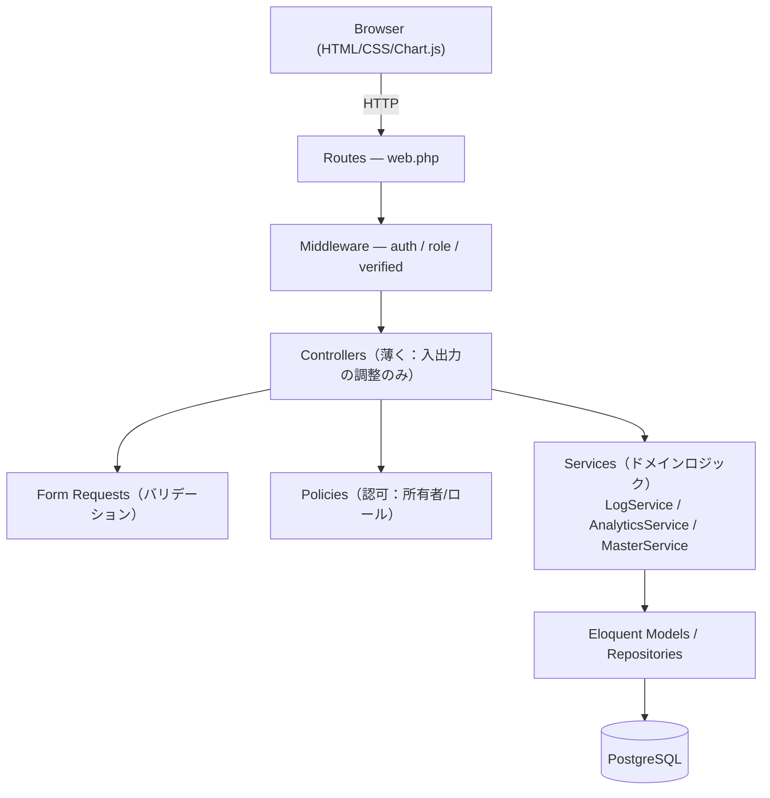
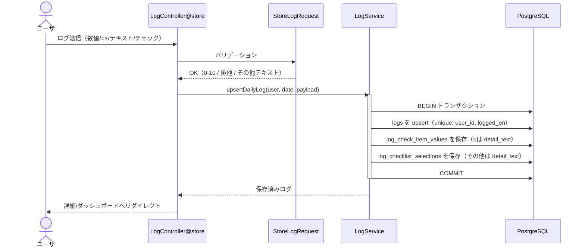
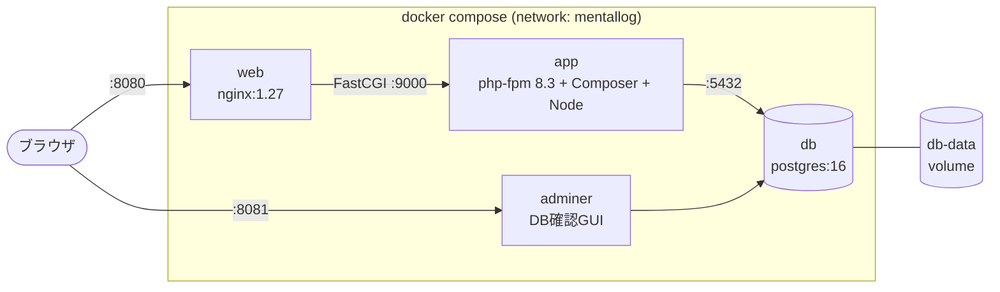

# MentalLog アーキテクチャ設計書

## 1. 全体方針

- **モノリシックなLaravel Webアプリ**として実装する（SPAにはしない）。
- 画面はLaravel（Blade）でサーバサイドレンダリング。フロントは **HTML + CSS** をモダンに整える。
- グラフ等の動的表現は最小限のJS（軽量ライブラリ）で補う。
- PCメイン。まずは動くもの → 分析機能を段階的に拡張。

---

## 2. 技術スタック

| レイヤ | 採用技術 | 補足 |
|---|---|---|
| 言語 | PHP 8.3 | Dockerイメージ `php:8.3-fpm` |
| フレームワーク | **Laravel 13**（実装時の最新安定版） | 当初 Laravel 11 想定だったが、2026時点で 11.x 系が Composer のセキュリティ勧告によりブロックされたため最新安定版を採用。構造・API はほぼ同一 |
| DB | PostgreSQL 16 | 集計・期間検索に強い |
| テンプレート | Blade | SSR |
| CSS | **Tailwind CSS（Breeze同梱）＋ カスタムプロパティ** | Breeze導入に伴いTailwindを採用（当初「素のCSS」想定から変更）。テーマ変数は `resources/css/app.css` |
| テスト | **Pest** | TDD。専用PostgreSQL(`mentallog_test`)に対して実行 |
| JS | Vanilla JS + Chart.js（グラフのみ） | Vite同梱 |
| ビルド | Vite（Laravel標準） | CSS/JSバンドル |
| 認証 | Laravel Breeze（Blade版） | ログイン/セッション（導入済み） |
| 認可 | Policy + Gate + Middleware | ロール制御・所有者チェック |
| 実行環境 | Docker（app/php-fpm + web/nginx + db/postgres + adminer） | `docker.md` 参照 |

> 認証は Breeze（Bladeスタック）を土台にし、ロール（管理者/一般）とPolicyを追加する構成。
> テストは Pest。テスト用DBは本番と同一エンジンの PostgreSQL（`mentallog_test`）を使用。

---

## 3. レイヤ構成



### 方針
- **Controllerは薄く**、業務ロジックは **Service** に集約。
- 集計（分析）はSQL寄せ（PostgreSQLの集計関数）でパフォーマンスを確保し、`AnalyticsService`で組み立てる。
- バリデーションは **FormRequest**、認可は **Policy** に分離。

---

## 4. ディレクトリ構成（Laravel想定）

```
app/
  Http/
    Controllers/
      Auth/...
      DashboardController.php
      LogController.php          # ログCRUD
      AnalyticsController.php    # 分析
      CheckItemController.php    # ○×項目マスタ（ユーザ毎）
      Admin/
        UserController.php       # ユーザ管理
        ChecklistOptionController.php  # 共通マスタ管理
    Requests/
      StoreLogRequest.php
      UpdateLogRequest.php
      LogFilterRequest.php
      StoreCheckItemRequest.php
    Middleware/
      EnsureUserIsAdmin.php
  Models/
    User.php
    Role.php
    Log.php
    CheckItem.php
    LogCheckItemValue.php
    ChecklistCategory.php
    ChecklistOption.php
    LogChecklistSelection.php
  Policies/
    LogPolicy.php
    CheckItemPolicy.php
  Services/
    LogService.php
    AnalyticsService.php
resources/
  views/
    layouts/app.blade.php
    auth/...
    dashboard/index.blade.php
    logs/{index,create,edit,show}.blade.php
    analytics/index.blade.php
    check_items/index.blade.php
    admin/users/...
    admin/checklist/...
  css/app.css
  js/app.js   # Chart.js初期化など
database/
  migrations/
  seeders/
    RoleSeeder.php
    ChecklistOptionSeeder.php    # 3カテゴリの初期選択肢
    DefaultCheckItemSeeder.php   # ○×項目テンプレ（ユーザ作成時に複製）
routes/
  web.php
```

---

## 5. 認証・認可設計

### 認証
- セッションベース（Breeze）。ログイン必須ルートは `auth` ミドルウェアで保護。

### 認可（ロール）
- `users.role_id` により **システム管理者 / 一般ユーザ** を判定。
- `EnsureUserIsAdmin` ミドルウェアで管理画面を保護。
- **所有者チェック**は `LogPolicy` / `CheckItemPolicy` で実施：
  - 一般ユーザ：`log.user_id === auth()->id()` のみ許可。
  - 管理者：全件許可。

### データ分離の原則
- ログ・○×項目マスタのクエリは常に `where('user_id', auth id)` を基本とする（管理者は例外的に解除）。
- Policy未通過の直接アクセス（ID推測）を防止。

---

## 6. 主要ユースケースの流れ

### 6.1 ログ登録（1日1件制御）



- `(user_id, logged_on)` のユニーク制約で重複防止。存在すれば更新、なければ作成。
- 数値・テキストは `logs`、○×は `log_check_item_values`、チェックは `log_checklist_selections` に保存。
- 全体をトランザクションで一括保存。

### 6.2 一覧・絞り込み
- `LogController@index` → `LogFilterRequest`。
- 条件：日付from/to、ストレス/体力/メンタル余裕の min/max。
- クエリビルダで動的に `where` 追加、ページネーション。

### 6.3 分析
- `AnalyticsController@index` → `AnalyticsService`：
  - 時系列：日付ごとの3数値（グラフ用JSON）。
  - 頻度集計：期間内の○×項目・チェック項目の出現回数（GROUP BY）。
  - 回復パターン（簡易）：回復行動ありの翌日のメンタル余裕平均 vs なしの日、等。

---

## 7. パフォーマンス・インデックス方針

- `logs(user_id, logged_on)` に複合ユニーク＆インデックス（一覧・期間検索の主軸）。
- 数値カラムに範囲検索用インデックス（必要に応じ `logs(user_id, stress)` 等）。
- 集計はPostgreSQL側で実施し、アプリ側ループを避ける。

---

## 8. セキュリティ・プライバシー

- 機微情報（メンタル状態）を扱うため、認可を厳格化。
- CSRF（Laravel標準）、パスワードハッシュ（bcrypt/argon）、Mass Assignment対策（`$fillable`）。
- ログ出力に本文テキストを残さない。
- 管理者による全件参照は要件だが、監査ログ（誰が閲覧したか）は将来拡張候補。

---

## 9. 環境・デプロイ（Docker想定）

### コンテナ構成



### 設定ファイル配置

```
docker/
  nginx/default.conf
  php/{Dockerfile, php.ini}
docker-compose.yml   # app(php-fpm) + web(nginx) + db(postgres) + adminer
.env                 # DB接続, ポート, UID/GID 等
```

- ローカル開発：`docker compose up` → `php artisan migrate --seed`。
- マイグレーション＋シーダーで初期ロール・チェックリストマスタを投入。
- 詳細手順は `docker.md` を参照。

---

## 10. 段階的リリース計画（案）

| フェーズ | 内容 |
|---|---|
| P1 | 認証・ロール、ログCRUD（数値/○×/テキスト/チェック）、○×マスタ、一覧＋絞り込み |
| P2 | ダッシュボード、時系列グラフ（見える化） |
| P3 | 傾向集計・回復パターン分析 |
| P4 | 管理者機能（ユーザ管理・共通マスタ管理）強化、監査・通知等の拡張 |
