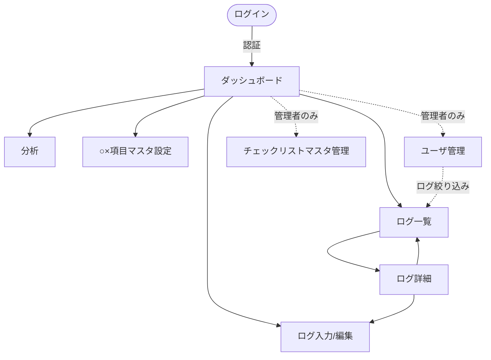

# MentalLog 画面設計書

## 0. 共通事項

- **対象**：PCブラウザメイン。モダンでシンプルなUI（余白広め、視認性優先）。
- **共通レイアウト**：左サイドナビ ＋ 右メインコンテンツ。上部にユーザ名/ログアウト。
- **配色イメージ**：落ち着いたトーン（メンタル系のため刺激を抑える）。ストレス高＝暖色、余裕高＝寒色などでスコアを直感表示。
- **入力思想**：毎日続けられるよう、ログ入力は1画面完結・スクロールで完了できる構成。

### 画面遷移図



### ナビゲーション（サイドメニュー）
| メニュー | 一般 | 管理者 |
|---|---|---|
| ダッシュボード | ○ | ○ |
| ログを書く | ○ | ○ |
| ログ一覧 | ○ | ○（全ユーザ） |
| 分析 | ○ | ○ |
| ○×項目の設定 | ○ | ○ |
| ユーザ管理 | － | ○ |
| チェックリスト管理 | － | ○ |

---

## 1. ログイン画面

- 要素：メールアドレス、パスワード、ログインボタン。
- エラー：認証失敗時にメッセージ表示。
- 未認証で保護ページにアクセス時はここへリダイレクト。

```
┌───────────────────────────┐
│           MentalLog        │
│                            │
│   Email    [___________]   │
│   Password [___________]   │
│            [ ログイン ]     │
│   ─ ログインエラー表示 ─     │
└───────────────────────────┘
```

---

## 2. ダッシュボード

今日の状態把握と入力導線を集約。

- **今日のログ状態**：未記入なら「今日のログを書く」ボタンを目立たせる。記入済みならサマリ表示。
- **直近の推移グラフ**：直近14日のストレス/体力/メンタル余裕の折れ線（見える化）。
- **簡易サマリ**：直近のストレス平均、よく出る「頭の中のクセ」トップ3など。

```
┌──────────────────────────────────────────────┐
│  こんにちは、○○さん          [今日のログを書く▶]  │
├──────────────────────────────────────────────┤
│  直近14日の推移                                  │
│   10┤          ┌─ストレス                        │
│    5┤ ～～～～～ ├─体力                           │
│    0┤          └─メンタル余裕                     │
│      └───────────────────────                    │
├───────────────┬──────────────────────────────┤
│ 直近ストレス平均 │ よく出る思考のクセ TOP3          │
│    6.2 / 10     │ 1. 自分のせいだと…              │
│                 │ 2. 全部ダメだと…               │
└───────────────┴──────────────────────────────┘
```

---

## 3. ログ入力 / 編集画面（最重要）

1画面で当日ログを完結入力。編集時は既存値をプリセット。

### セクション構成（縦スクロール）

**① 対象日**
- 日付選択（デフォルト今日）。既存があれば編集モードに切替。

**② 数値（0〜10スライダー or ボタン）**
- ストレス / 体力 / メンタル余裕。スライダー＋数値表示。色で強弱を可視化。

```
ストレス      0 ─●──────── 10   [6]
体力          0 ──────●─── 10   [7]
メンタル余裕   0 ────●───── 10   [5]
```

**③ ○×項目（ユーザマスタ）**
- マスタ項目ごとに ○ / × をトグル。○選択時のみ内容テキスト入力欄を展開。

```
仕事        [ ○ | ✕ ]   ○→ [内容: 締切対応で残業___]
バンド関係   [ ○ | ✕ ]
コミュニティA [ ○ | ✕ ]
自分の疲労   [ ○ | ✕ ]   ○→ [内容: 寝不足___]
その他       [ ○ | ✕ ]
                        [＋ 項目を編集（マスタ設定へ）]
```

**④ テキスト**
- 今日一番きつかったこと（textarea）
- 一言まとめ（1行）

**⑤ 頭の中のクセ（超重要・複数選択）**
- チェックボックス。「特になし」を選ぶと他は無効化（排他）。

```
□ 全部ダメだと思った（0-100思考）
□ 自分のせいだと思いすぎた
□ 相手の気持ちを勝手に想像して疲れた
□ 同時に全部解決しようとした
□ 何も考えたくなくなった
□ 特になし
```

**⑥ 体の反応（複数選択）**
- 睡眠が浅い / 胃・胸が重い / イライラ / 無気力 / 頭が回らない / 特になし（排他）

**⑦ 今日やった回復行動（複数選択・できたものだけ）**
- 温泉・サウナ / 食事で回復 / 音楽・バンド系 / 一人時間 / 軽い運動・散歩 / 何もできてない / その他（→テキスト）

**⑧ 保存**
- [ 保存する ] / [ キャンセル ]。保存後は詳細 or ダッシュボードへ。

### バリデーション
- 数値は0〜10必須。
- 同一日重複は不可（既存は編集扱い）。
- 「特になし」と他項目の同時選択不可。
- ○選択かつ内容空欄は許容（任意）。「その他」選択時はテキスト推奨。

---

## 4. ログ一覧画面

自分のログを一覧・絞り込み（管理者は全ユーザ対象＋ユーザ絞り込み）。

### 絞り込みパネル
- 日付：from 〜 to
- ストレス：min 〜 max
- 体力：min 〜 max
- メンタル余裕：min 〜 max
- （管理者のみ）ユーザ選択
- [ 検索 ] [ クリア ]

### 一覧テーブル
| 日付 | ストレス | 体力 | 余裕 | 主なストレス源(○) | 一言まとめ | 操作 |
|---|---|---|---|---|---|---|
| 2026-07-06 | 6 | 7 | 5 | 仕事, 自分の疲労 | しんどいが持ち直し | 詳細/編集/削除 |

- 数値はセルを色分け（高ストレス=赤系）。
- ページネーション。日付降順デフォルト。

```
┌── 絞り込み ─────────────────────────────────────┐
│ 期間 [2026-06-01]〜[2026-07-06]                   │
│ ストレス [0]-[10]  体力 [0]-[10]  余裕 [0]-[10]    │
│                                    [検索][クリア]   │
├──────────────────────────────────────────────┤
│ 日付 | ｽﾄﾚｽ | 体力 | 余裕 | ○項目 | まとめ | 操作   │
│ 07/06|  6  |  7  |  5  | 仕事… | …    |詳細/編集│
│ 07/05|  8  |  4  |  3  | 仕事… | …    |詳細/編集│
└──────────────────────────────────────────────┘
```

---

## 5. ログ詳細画面

1件の全内容を読みやすく表示。

- 数値（バッジ/バー表示）
- ○×項目（○のもの＋内容を強調、×は淡色）
- テキスト2種
- チェック3カテゴリ（選択されたものをタグ表示）
- [ 編集 ] [ 削除 ] [ 一覧へ戻る ]

```
┌ 2026-07-06 のログ ───────────────────────────┐
│ ストレス ██████░░░░ 6   体力 ███████░░░ 7      │
│ メンタル余裕 █████░░░░░ 5                        │
├──────────────────────────────────────────────┤
│ ストレス源(○): 仕事「締切対応」/ 自分の疲労「寝不足」│
├──────────────────────────────────────────────┤
│ 一番きつかったこと： …                            │
│ 一言まとめ： …                                   │
├──────────────────────────────────────────────┤
│ 頭のクセ： #自分のせい #全部ダメ                   │
│ 体の反応： #睡眠が浅い #イライラ                    │
│ 回復行動： #音楽・バンド系 #一人時間                │
└──────────────────────────────────────────────┘
       [編集]  [削除]  [一覧へ]
```

---

## 6. 分析画面

傾向と回復パターンの可視化。期間を指定して集計。

### 集計期間
- from 〜 to（デフォルト直近30日）

### ① 数値の時系列（見える化）
- ストレス/体力/メンタル余裕の折れ線グラフ。

### ② ストレス源の傾向
- ○になった○×項目の頻度（横棒）。
- 高ストレス日（例 stress≥7）に多い項目の抽出。

### ③ 頭の中のクセの傾向（重要）
- 出現頻度ランキング。ストレスとの共起。

### ④ 体の反応の傾向
- 頻度ランキング。

### ⑤ 回復パターン
- 回復行動ごとの頻度。
- 回復行動を取った翌日のメンタル余裕平均 vs 取らなかった翌日の平均（効いた行動の示唆）。

```
┌ 分析（2026-06-06〜07-06）────────────────────┐
│ [時系列グラフ：ストレス/体力/余裕]               │
├──────────────────────────────────────────────┤
│ ストレス源TOP        頭のクセTOP                 │
│ 仕事      ████████    自分のせい ██████          │
│ 自分の疲労 █████       全部ダメ   ████            │
├──────────────────────────────────────────────┤
│ 回復パターン                                     │
│ 温泉・サウナ → 翌日余裕 +1.8                      │
│ 音楽・バンド → 翌日余裕 +1.2                      │
│ 何もできてない → 翌日余裕 -0.5                     │
└──────────────────────────────────────────────┘
```

---

## 7. ○×項目マスタ設定画面（一般ユーザ）

自分のストレス源カテゴリを管理。

- 一覧（名前 / 表示順 / 有効）＋ 並び替え。
- 追加：名前入力 → 追加。
- 編集：名称変更 / 有効・無効切替。
- 「コミュニティ」は複数追加で表現（コミュニティA, B…）。
- 無効化しても過去ログは保持（表示のみ）。

```
┌ ○×項目の設定 ───────────────────────────────┐
│ ≡ 仕事          [編集][無効化]                   │
│ ≡ バンド関係     [編集][無効化]                   │
│ ≡ コミュニティA   [編集][無効化]                   │
│ ≡ 自分の疲労     [編集][無効化]                   │
│ ≡ その他        [編集][無効化]                    │
│ ──────────────                                  │
│ 新規: [__________]  [追加]                        │
└──────────────────────────────────────────────┘
```

---

## 8. ユーザ管理画面（管理者のみ）

- ユーザ一覧（名前 / メール / ロール / 状態）。
- 新規登録 / 編集（ロール変更・有効無効）。
- 各ユーザのログ参照導線（一覧へユーザ絞り込みで遷移）。

```
┌ ユーザ管理 ──────────────────────────────────┐
│ 名前  | メール         | ロール   | 状態 | 操作    │
│ 山田  | y@ex.com      | 一般     | 有効 |編集/ログ│
│ 管理者| a@ex.com      | 管理者   | 有効 |編集     │
│                                   [＋新規登録]    │
└──────────────────────────────────────────────┘
```

---

## 9. チェックリストマスタ管理画面（管理者のみ）

共通マスタ（頭の中のクセ / 体の反応 / 回復行動）の選択肢を管理。

- カテゴリタブ切替。
- 選択肢の追加 / 編集 / 並び替え / 有効無効。
- `requires_text`（テキスト補足要否）、`is_none`（特になしフラグ）の設定。

```
┌ チェックリスト管理 ─────────────────────────────┐
│ [頭の中のクセ][体の反応][回復行動]                  │
│ ─────────────                                   │
│ ≡ 温泉・サウナ      [編集][無効化]                 │
│ ≡ 食事で回復        [編集][無効化]                 │
│ ≡ その他 (テキスト要) [編集][無効化]               │
│ 新規: [________] □テキスト要 □特になし [追加]       │
└──────────────────────────────────────────────┘
```

---

## 10. 状態・エラー表示の共通仕様

- 保存成功：フラッシュメッセージ（「保存しました」）。
- バリデーションエラー：該当項目下に赤字表示。
- 権限なしアクセス：403 画面（他人のログ等）。
- 空状態：一覧0件時は「まだログがありません。今日のログを書きましょう」導線。
