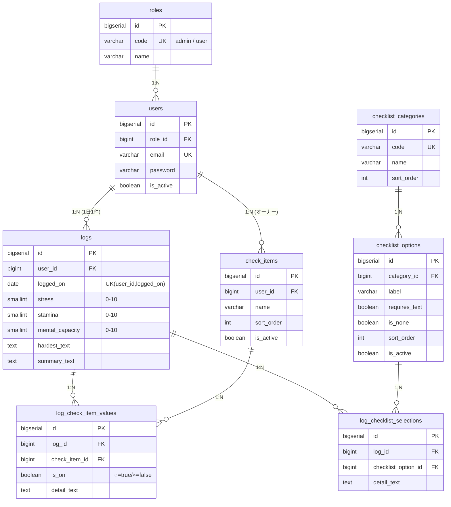

# MentalLog データモデル設計書

## 1. 概要

1ユーザが「1日1件のログ」を記録する。ログは以下4種の情報で構成される。

- **数値**：ストレス / 体力 / メンタル余裕（0〜10）
- **○×項目**：ストレス源カテゴリ（ユーザ毎マスタ）＋○のときの補足テキスト
- **テキスト**：今日一番きつかったこと / 一言まとめ
- **チェック**：頭の中のクセ / 体の反応 / 回復行動（マスタ選択、複数可）

---

## 2. ER図（論理）



### エンティティ関係サマリ
- `users` : `logs` = 1 : N（1日1件だが日付でN件蓄積）
- `logs` : `log_check_item_values` = 1 : N（○×項目の回答）
- `logs` : `log_checklist_selections` = 1 : N（チェック選択）
- `check_items` : オーナーは `users`（ユーザ毎マスタ）
- `checklist_categories` : `checklist_options` = 1 : N（共通マスタ）

---

## 3. テーブル定義

### 3.1 roles（ロールマスタ）

| カラム | 型 | 制約 | 説明 |
|---|---|---|---|
| id | bigserial | PK | |
| code | varchar(30) | unique, not null | `admin` / `user` |
| name | varchar(50) | not null | 表示名（システム管理者/一般ユーザ） |
| created_at / updated_at | timestamptz | | |

初期データ：`admin`（システム管理者）, `user`（一般ユーザ）

---

### 3.2 users（ユーザ）

| カラム | 型 | 制約 | 説明 |
|---|---|---|---|
| id | bigserial | PK | |
| role_id | bigint | FK→roles.id, not null | ロール |
| name | varchar(100) | not null | 氏名/表示名 |
| email | varchar(255) | unique, not null | ログインID |
| password | varchar(255) | not null | ハッシュ |
| is_active | boolean | not null default true | 無効化フラグ |
| email_verified_at | timestamptz | null | |
| remember_token | varchar(100) | null | |
| created_at / updated_at | timestamptz | | |

インデックス：`unique(email)`

---

### 3.3 logs（日次ログ）

1ユーザ・1日につき1レコード。

| カラム | 型 | 制約 | 説明 |
|---|---|---|---|
| id | bigserial | PK | |
| user_id | bigint | FK→users.id, not null | 所有者 |
| logged_on | date | not null | 対象日（JST） |
| stress | smallint | not null, 0〜10 | ストレス |
| stamina | smallint | not null, 0〜10 | 体力 |
| mental_capacity | smallint | not null, 0〜10 | メンタル余裕 |
| hardest_text | text | null | 今日一番きつかったこと |
| summary_text | text | null | 一言まとめ |
| created_at / updated_at | timestamptz | | |

制約・インデックス：
- `unique(user_id, logged_on)` … 1日1件を保証（upsertキー）
- `index(user_id, logged_on)` … 期間検索
- CHECK：`stress BETWEEN 0 AND 10`、`stamina BETWEEN 0 AND 10`、`mental_capacity BETWEEN 0 AND 10`

---

### 3.4 check_items（○×項目マスタ：ユーザ毎）

ストレス源カテゴリ。ユーザが自由に定義・並び替え・無効化できる。

| カラム | 型 | 制約 | 説明 |
|---|---|---|---|
| id | bigserial | PK | |
| user_id | bigint | FK→users.id, not null | オーナー |
| name | varchar(100) | not null | 項目名（例：仕事、バンド関係、コミュニティA） |
| sort_order | int | not null default 0 | 表示順 |
| is_active | boolean | not null default true | 無効化（過去ログは保持） |
| created_at / updated_at | timestamptz | | |

インデックス：`index(user_id, sort_order)`

初期テンプレート（ユーザ作成時に複製投入）：
仕事 / バンド関係 / コミュニティ / 自分の疲労 / その他
※「コミュニティ（複数）」はユーザが複数レコードを追加して表現（例：コミュニティA、コミュニティB）。

---

### 3.5 log_check_item_values（ログ×○×項目の回答）

| カラム | 型 | 制約 | 説明 |
|---|---|---|---|
| id | bigserial | PK | |
| log_id | bigint | FK→logs.id (cascade delete), not null | 対象ログ |
| check_item_id | bigint | FK→check_items.id, not null | 対象項目 |
| is_on | boolean | not null default false | ○=true / ×=false |
| detail_text | text | null | ○のときの内容補足 |
| created_at / updated_at | timestamptz | | |

制約・インデックス：
- `unique(log_id, check_item_id)` … 1ログ1項目1回答
- `index(check_item_id, is_on)` … 集計用

---

### 3.6 checklist_categories（チェックリストのカテゴリ：共通マスタ）

| カラム | 型 | 制約 | 説明 |
|---|---|---|---|
| id | bigserial | PK | |
| code | varchar(30) | unique, not null | `thought_habit` / `body_reaction` / `recovery_action` |
| name | varchar(50) | not null | 頭の中のクセ / 体の反応 / 回復行動 |
| sort_order | int | not null default 0 | |
| created_at / updated_at | timestamptz | | |

初期データ：
- `thought_habit`（頭の中のクセ）
- `body_reaction`（体の反応）
- `recovery_action`（回復行動）

---

### 3.7 checklist_options（チェック選択肢：共通マスタ）

| カラム | 型 | 制約 | 説明 |
|---|---|---|---|
| id | bigserial | PK | |
| category_id | bigint | FK→checklist_categories.id, not null | 所属カテゴリ |
| label | varchar(150) | not null | 選択肢文言 |
| requires_text | boolean | not null default false | 「その他」等でテキスト補足を要するか |
| is_none | boolean | not null default false | 「特になし」フラグ（排他制御用） |
| sort_order | int | not null default 0 | |
| is_active | boolean | not null default true | |
| created_at / updated_at | timestamptz | | |

インデックス：`index(category_id, sort_order)`

初期データ：

**thought_habit（頭の中のクセ）**
| label | is_none |
|---|---|
| 全部ダメだと思った（0-100思考） | |
| 自分のせいだと思いすぎた | |
| 相手の気持ちを勝手に想像して疲れた | |
| 同時に全部解決しようとした | |
| 何も考えたくなくなった | |
| 特になし | ✓ |

**body_reaction（体の反応）**
| label | is_none |
|---|---|
| 睡眠が浅い | |
| 胃・胸が重い | |
| イライラ | |
| 無気力 | |
| 頭が回らない | |
| 特になし | ✓ |

**recovery_action（回復行動）**
| label | requires_text |
|---|---|
| 温泉・サウナ | |
| 食事で回復 | |
| 音楽・バンド系 | |
| 一人時間 | |
| 軽い運動・散歩 | |
| 何もできてない | |
| その他 | ✓ |

---

### 3.8 log_checklist_selections（ログ×チェック選択）

複数選択を行数で表現。

| カラム | 型 | 制約 | 説明 |
|---|---|---|---|
| id | bigserial | PK | |
| log_id | bigint | FK→logs.id (cascade delete), not null | 対象ログ |
| checklist_option_id | bigint | FK→checklist_options.id, not null | 選ばれた選択肢 |
| detail_text | text | null | 「その他」等の補足 |
| created_at / updated_at | timestamptz | | |

制約・インデックス：
- `unique(log_id, checklist_option_id)` … 同一選択肢の重複防止
- `index(checklist_option_id)` … 頻度集計用

---

## 4. Eloquentリレーション（要点）

```php
// Role
hasMany(User)

// User
belongsTo(Role)
hasMany(Log)
hasMany(CheckItem)
// 便宜メソッド: isAdmin()

// Log
belongsTo(User)
hasMany(LogCheckItemValue)
hasMany(LogChecklistSelection)

// CheckItem
belongsTo(User)
hasMany(LogCheckItemValue)

// LogCheckItemValue
belongsTo(Log)
belongsTo(CheckItem)

// ChecklistCategory
hasMany(ChecklistOption)

// ChecklistOption
belongsTo(ChecklistCategory)
hasMany(LogChecklistSelection)

// LogChecklistSelection
belongsTo(Log)
belongsTo(ChecklistOption)
```

---

## 5. 設計上の判断・補足

- **1日1件**：`logs.unique(user_id, logged_on)` で保証。再入力は更新（upsert）。
- **マスタの無効化**：`is_active=false` で論理削除。過去ログの参照整合性を保つため物理削除しない。
- **○×項目はユーザ毎**：`check_items.user_id` で所有。テンプレはシーダ→ユーザ作成時複製。
- **チェックリストは共通マスタ**：初期はシステム共通。将来ユーザ独自項目を許すなら `checklist_options.user_id`（nullable）を追加して拡張可能（null=共通）。
- **「特になし」排他**：`is_none=true` を選んだ場合は同カテゴリ他選択肢を選べない、というUI/バリデーション制御を行う。
- **削除時**：ログ削除で子（values / selections）は cascade delete。
- **分析クエリ例**：
  - 傾向：`log_check_item_values`／`log_checklist_selections` を期間・ユーザで JOIN し GROUP BY で頻度集計。
  - 回復パターン：`recovery_action` 選択日の翌日 `logs.mental_capacity` を自己結合（logged_on + 1）で比較。

---

## 6. マイグレーション順序

1. roles
2. users（role_id FK）
3. check_items（user_id FK）
4. checklist_categories
5. checklist_options（category_id FK）
6. logs（user_id FK）
7. log_check_item_values（log_id, check_item_id FK）
8. log_checklist_selections（log_id, checklist_option_id FK）

シーダ：RoleSeeder → ChecklistCategorySeeder → ChecklistOptionSeeder →（ユーザ作成時に DefaultCheckItem 複製）
